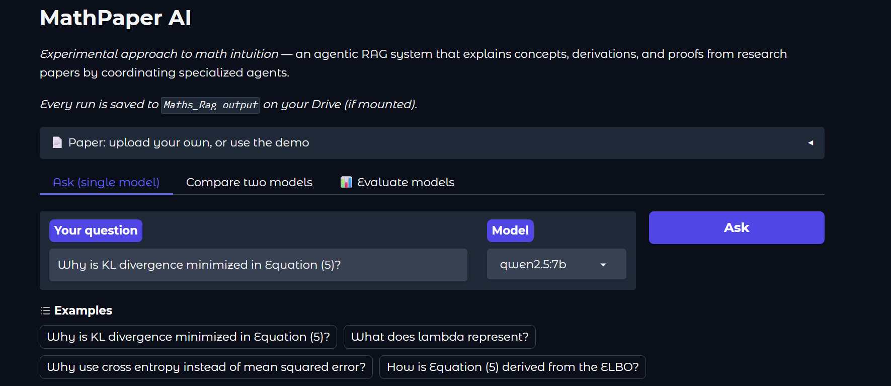
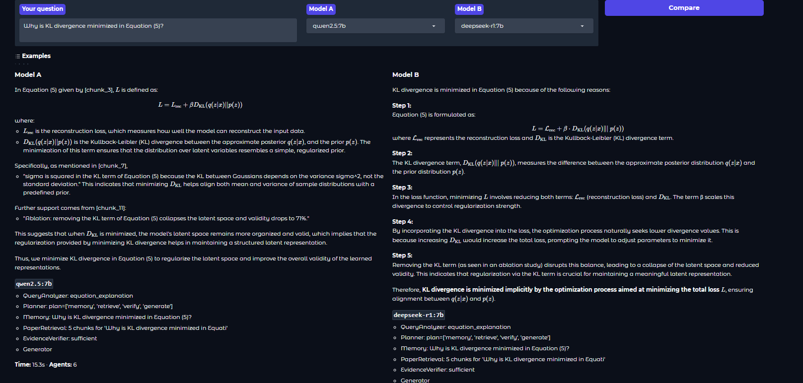
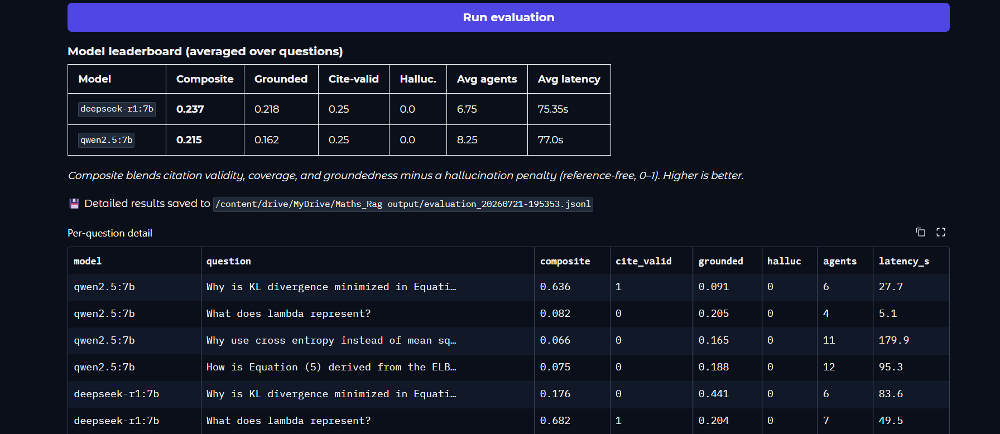

# MathPaper AI

> **Experimental approach to math intuition** — an agentic RAG system that explains
> concepts, derivations, and proofs from research papers by retrieving the
> prerequisite knowledge papers assume but never define.

Instead of one LLM doing everything, MathPaper AI decomposes each question into a
team of specialized agents — a planner coordinates retrieval, prerequisite-filling,
memory, evidence verification, explanation, and citation checking. This modular
design improves accuracy, reduces hallucination, and cuts latency by invoking only
the agents a given query actually needs.


[](https://colab.research.google.com/github/sourds42/mathpaper-ai/blob/main/MathPaper_AI_Colab.ipynb)

---

## Demo

A live, interactive web demo (Gradio) runs the full multi-agent pipeline on local
open models — no API key required. Launch it from the [Colab notebook](MathPaper_AI_Colab.ipynb)
and it prints a public link.

**Ask a question — one model, with a live agent trace and LaTeX-rendered math:**



**Compare two models side-by-side** on the same question, each with its own agent
trace, timing, and agent count:



**Evaluate and rank models** across a question set using reference-free
faithfulness / groundedness / hallucination metrics:



Every run is saved to a `Maths_Rag output` folder on Google Drive (when mounted)
for later analysis.

---

## Why multi-agent?

A plain RAG pipeline fails on math papers for four reasons: equations get split
from their explanations during chunking; papers assume prerequisite knowledge they
never define; the model hallucinates when retrieval is incomplete; and follow-up
questions lose context. Each agent targets one of these failure modes.

```
                         User Question
                              │
                     Query Analyzer Agent      (intent + expertise level)
                              │
                       Planning Agent          (chooses the minimal pipeline)
                              │
        ┌─────────────────────┼─────────────────────┐
        │                     │                     │
  Paper Retrieval       Math Knowledge         Memory Agent
     Agent (hybrid)     Agent (fills gaps)     (multi-turn context)
        │                     │
        └──────────┬──────────┘
                   │
        Evidence Verification Agent    (blocks unsupported answers → re-retrieve)
                   │
        Explanation Generator Agent    (grounded, LaTeX, expertise-adapted)
                   │
        Citation Validation Agent      (rejects unsupported claims)
                   │
              Final Answer
```

**Dynamic orchestration** is the key idea: a simple variable lookup runs 3 agents;
a full derivation runs all 7. The planner picks the path per query.

---

## Quickstart

### Zero setup (no API key, runs offline)

```bash
pip install -e ".[dev]"
pytest tests/ -v        # orchestration tests with a mocked LLM
python evaluate.py      # retrieval benchmark + charts in results/
```

### Run on Google Colab (no local hardware needed)

Open `MathPaper_AI_Colab.ipynb` in Colab (badge above). It clones the repo,
installs everything, and has ready-to-run cells for: the offline benchmark, the
free-cloud-API pipeline (Groq), and local models on Colab's free T4 GPU. Ideal if
your own machine is low on RAM/VRAM.

### Host a live web demo (Gradio, from Colab)

`app.py` is a Gradio web UI for the pipeline with three features:
**(1)** upload your own paper (PDF) instead of the built-in demo,
**(2)** live agent status — watch each agent fire in the backend,
**(3)** compare two models side-by-side, and
**(4)** an **Evaluate** tab that scores multiple models across a question set on reference-free faithfulness/groundedness metrics and ranks them.

In your Colab notebook, after the setup + Ollama cells:

```python
!pip install -q gradio pymupdf
import os
os.environ["LLM_PROVIDER"] = "ollama"
!python app.py          # prints a public *.gradio.live link, live while the session runs
```

Share the printed URL for a working, interactive demo. LaTeX renders in answers.

> PDF note: extraction is lightweight (PyMuPDF) — great for text and inline math,
> but complex typeset equations may not survive perfectly. Scanned/image PDFs need
> OCR and aren't supported.

### End-to-end with a free LLM provider

The agent layer is provider-agnostic (`src/mathpaper/llm.py`). Get a free key —
Groq and Google AI Studio need no credit card — then:

```bash
export LLM_PROVIDER=groq
export GROQ_API_KEY=gsk_your_key
python -m mathpaper.agents        # runs the full pipeline on a sample question
```

Supported providers: `groq`, `gemini`, `openrouter`, `github`, `ollama` (local),
`anthropic`. See [SETUP.md](SETUP.md) for keys and free-tier limits.

### Interactive demo

`demo/demo.jsx` is a self-contained React component: paste it into a Claude.ai
artifact to watch the agents light up in real time, with LaTeX-rendered equations
and clickable citations.

---

## Results

Reproducible mini-benchmark (15-chunk corpus, 16 labeled queries). Full write-up
and honest caveats in [RESULTS.md](RESULTS.md).

| Configuration | Recall@3 | MRR |
|---|---|---|
| Fixed chunks + dense (baseline) | 0.875 | 0.818 |
| Equation-anchored + dense | 0.938 | 0.856 |
| Equation-anchored + BM25 | 0.938 | 0.859 |
| Equation-anchored + hybrid (RRF) | 0.938 | 0.856 |

Dynamic orchestration cuts the most common query type (variable lookup) from 7
agent invocations to 3 — about 57% fewer LLM calls — while keeping the full
pipeline for derivations.

### Model comparison (local, via the Evaluate tab)

Running the same pipeline across local models on a Colab T4 surfaced a real
three-way tradeoff between reliability, reasoning, and speed:

| Model | Notes |
|---|---|
| `qwen2.5:7b` | Clean structured output, reliable JSON; slower on long derivations |
| `deepseek-r1:7b` | Reasoning model — emits `<think>` blocks that need stripping before JSON parsing; step-by-step answers |
| `llama3.2:3b` | Fastest (seconds on simple lookups) but occasionally emits invalid JSON, needing fail-safe handling |

This motivated `safe_json` in `agents.py`, which tolerates reasoning tags, code
fences, and malformed output so a single bad response never crashes a run.

---

## Project layout

```
src/mathpaper/
  agents.py       8 agents + Planner (dynamic orchestration, verify loop, safe_json)
  retrieval.py    hybrid dense + BM25 retrieval (RRF), demo corpus
  llm.py          provider-agnostic LLM adapter (stdlib only)
  ingest.py       PDF -> equation-anchored corpus (upload your own paper)
  evaluation.py   reference-free answer scoring (faithfulness / groundedness)
tests/            orchestration, ingestion, and scoring tests (no key needed)
app.py            Gradio web demo: ask, compare, evaluate
evaluate.py       retrieval + orchestration benchmark
demo/demo.jsx     standalone React demo with LaTeX rendering
MathPaper_AI_Colab.ipynb   one-click Colab runner
results/          benchmark output (json + charts)
```

---

## How it works (interview notes)

- **Agents** are LLMs with focused roles that make decisions (the planner routes,
  the verifier blocks). **Tools** are what they call (vector search, BM25,
  reranker, external references). **Memory** is shared working state (`AgentState`)
  plus conversation history for follow-ups.
- **Model routing:** classification and memory use a small/fast model; planning,
  verification, and explanation use a stronger reasoning model — a deliberate
  cost/quality split, configurable per provider.
- **Testing strategy:** agent *routing* is tested separately from LLM *quality*
  with a mocked LLM, so the pipeline is debuggable and CI runs with no API key.

---

## License

MIT — see [LICENSE](LICENSE).
